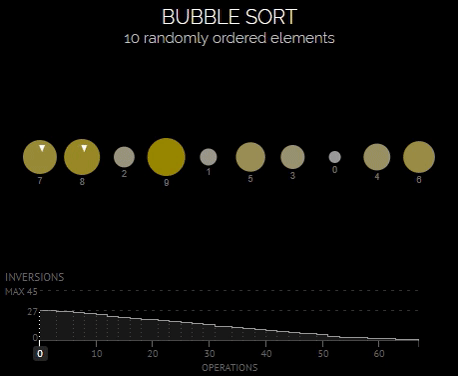
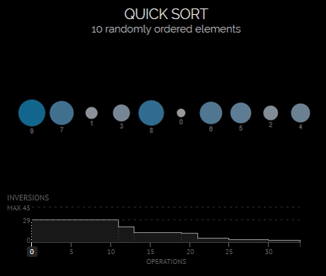
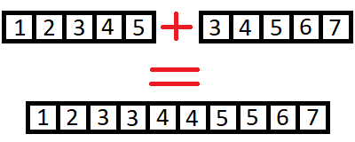
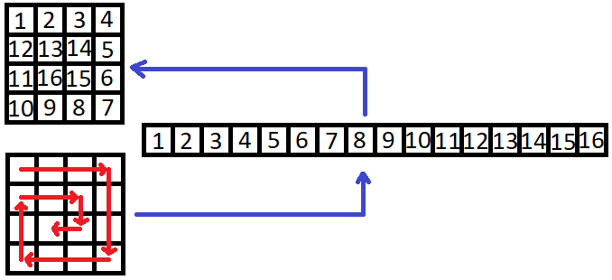
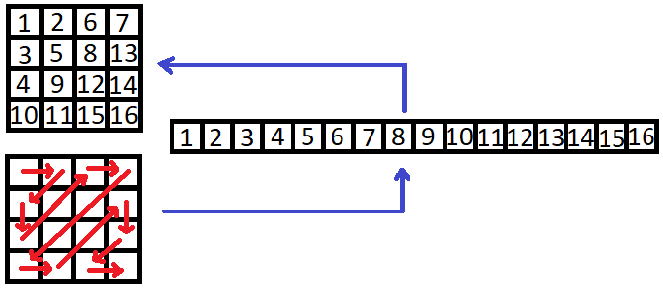

Table of Contents
=================


* [Table of Contents](#table-of-contents)
* [1. Sort](#1-sort)
  * [1.1 Insertion sort](#11-insertion-sort)
  * [1.2 Bubble sort](#12-bubble-sort)
  * [1.3 Quick sort](#13-quick-sort)
  * [1.4 Results](#14-results)
* [2. Merge](#2-merge)
* [3. Transformation](#3-transformation)
  * [3.1 Spiral](#31-spiral) 
  * [3.2 Snake](#32-snake)


# 1. Sort
## 1.1 Insertion sort
### Intro
Worst-case:
* $O(n^2)$

Best-case:
* $O(n)$

Average:
* $O(n^2)$


### Example:
```python
from ssu_2.algo.scripts.sort import insertion_sort

array = [5, 1, 2, -1, 0, -2]

ascending_order = insertion_sort(array)
# ascending_order = [-2, -1, 0, 1, 2, 5]

descending_order = insertion_sort(array, reverse=True)
# descending_order = [5, 2, 1, 0, -1, -2]

```


## 1.2 Bubble sort
### Intro
Worst-case:
* $O(n^2)$

Best-case:
* $O(n)$

Average:
* $O(n^2)$





### Example:
```python
from ssu_2.algo.scripts.sort import bubble_sort

array = [5, 1, 2, -1, 0, -2]

ascending_order = bubble_sort(array)
# ascending_order = [-2, -1, 0, 1, 2, 5]

descending_order = bubble_sort(array, reverse=True)
# descending_order = [5, 2, 1, 0, -1, -2]

```


## 1.3 Quick sort
### Intro
Worst-case:
* $O(n^2)$

Best-case:
* $O(n log n)$ or $O(n)$

Average:
* $O(n log n)$





### Example:
```python
from ssu_2.algo.scripts.sort import quick_sort

array = [5, 1, 2, -1, 0, -2]

ascending_order = quick_sort(array)
# ascending_order = [-2, -1, 0, 1, 2, 5]

descending_order = quick_sort(array, reverse=True)
# descending_order = [5, 2, 1, 0, -1, -2]

```

## 1.4 Results


| Lang   | Sort           | Quantity | Time                |
|--------|----------------|----------|---------------------|
| Python | quick_sort     | 20000    | 0.19734890000108862 |
| Go     | quick_sort     | 20000    | 0.006830            |
| Python | insertion_sort | 20000    | 215.84466210000028  |
| Go     | insertion_sort | 20000    | 0.041886            |
| Python | bubble_sort    | 20000    | 540.0643361999973   |
| Go     | bubble_sort    | 20000    | 0.330021            |
| Python | quick_sort     | 40000    | 0.03231469999809633 |
| Go     | quick_sort     | 40000    | 0.011960            |
| Python | insertion_sort | 40000    | 8.191215800001373   |
| Go     | insertion_sort | 40000    | 0.172285            |
| Python | bubble_sort    | 40000    | 20.197163000000728  |
| Go     | bubble_sort    | 40000    | 1.599059            |
| Python | quick_sort     | 60000    | 0.07350030000088736 |
| Go     | quick_sort     | 60000    | 0.018936            |
| Python | insertion_sort | 60000    | 32.96276209999996   |
| Go     | insertion_sort | 60000    | 0.351233            |
| Python | bubble_sort    | 60000    | 80.94080399999802   |
| Go     | bubble_sort    | 60000    | 3.976457            |
| Python | quick_sort     | 80000    | 0.11685260000012931 |
| Go     | quick_sort     | 80000    | 0.027901            |
| Python | insertion_sort | 80000    | 75.39991450000161   |
| Go     | insertion_sort | 80000    | 0.696300            |
| Python | bubble_sort    | 80000    | 188.2263942000027   |
| Go     | bubble_sort    | 80000    | 7.095833            |
| Python | quick_sort     | 100000   | 0.14743580000140355 |
| Go     | quick_sort     | 100000   | 0.033759            |
| Python | insertion_sort | 100000   | 135.89978740000151  |
| Go     | insertion_sort | 100000   | 0.972726            |
| Python | bubble_sort    | 100000   | 337.7025479999975   |
| Go     | bubble_sort    | 100000   | 11.219633           |
| Go     | quick_sort     | 1000000  | 3.190227            |
| Go     | insertion_sort | 1000000  | 596.068868          |
| Go     | bubble_sort    | 1000000  | 5187.986088         |


# 2. Merge
### Intro
Performance:
* $O(n + m)$



### Example
```python
from ssu_2.algo.scripts.merge import merge

first = [1, 2, 3, 4, 5]
second = [3, 4, 5, 6, 7]

ascending_order = merge(first, second)
# ascending_order = [1, 2, 3, 3, 4, 4, 5, 5, 6, 7]

first.reverse()
second.reverse()

descending_order = merge(first, second, reverse=True)
# descending_order = [7, 6, 5, 5, 4, 4, 3, 3, 2, 1]


```
# 3. Transformation
## 3.1 Spiral
### Intro
Performance:
* $O(n)$



```python
from ssu_2.algo.scripts.conversion import spiral

matrix = [
    [1, 2, 3, 4],
    [12, 13, 14, 5],
    [11, 16, 15, 6],
    [10, 9, 8, 7],
]

direct = spiral(matrix)
# direct = [1, 2, 3, 4, 5, 6, 7, 8, 9, 10, 11, 12, 13, 14, 15, 16]

converse = spiral(direct)
# converse = [
#   [1, 2, 3, 4],
#   [12, 13, 14, 5],
#   [11, 16, 15, 6],
#   [10, 9, 8, 7],
#]

```

## 3.2 Snake
### Intro
Performance:
* $O(n)$



```python
from ssu_2.algo.scripts.conversion import snake

matrix = [
    [1, 2, 6, 7],
    [3, 5, 8, 13],
    [4, 9, 12, 14],
    [10, 11, 15, 16],
]

direct = snake(matrix)
# direct = [1, 2, 3, 4, 5, 6, 7, 8, 9, 10, 11, 12, 13, 14, 15, 16]

converse = snake(direct)
# converse = [
#    [1, 2, 6, 7],
#    [3, 5, 8, 13],
#    [4, 9, 12, 14],
#    [10, 11, 15, 16],
#]

```
